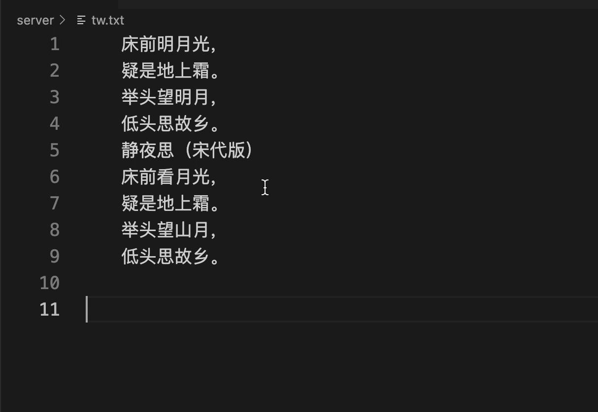

  
  
将文件内的中文简体转换成繁体

  

    
    
  

# vscode-translate-tw
将文件内的中文简体转换成繁体，基于 [https://github.com/xjh22222228/translate-tw](https://github.com/xjh22222228/translate-tw)

## Install
VSCode Extensions search `translate-tw`.

## LICENSE
MIT
